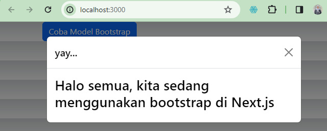
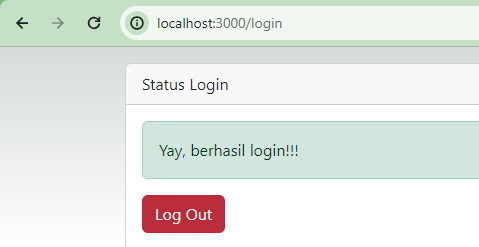
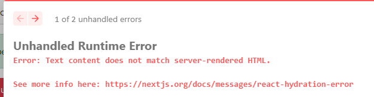

This is a [Next.js](https://nextjs.org/) project bootstrapped with [`create-next-app`](https://github.com/vercel/next.js/tree/canary/packages/create-next-app).

## Getting Started

First, run the development server:

```bash
npm run dev
# or
yarn dev
# or
pnpm dev
# or
bun dev
```

Open [http://localhost:3000](http://localhost:3000) with your browser to see the result.

You can start editing the page by modifying `pages/index.tsx`. The page auto-updates as you edit the file.

[API routes](https://nextjs.org/docs/api-routes/introduction) can be accessed on [http://localhost:3000/api/hello](http://localhost:3000/api/hello). This endpoint can be edited in `pages/api/hello.ts`.

The `pages/api` directory is mapped to `/api/*`. Files in this directory are treated as [API routes](https://nextjs.org/docs/api-routes/introduction) instead of React pages.

This project uses [`next/font`](https://nextjs.org/docs/basic-features/font-optimization) to automatically optimize and load Inter, a custom Google Font.

## Laporan Praktikum Minggu 6

Nama: Wulan Maulidiah <br>
NIM: 2341728038 <br>
Kelas: TI - 3A

1. Menjalankan project next.js
 <br>
2. Mengakses http://localhost:3000/login, dan klik tombol login. Kemudian lakukan refresh page berkali-kali (jika perlu restart npm run dev nya). Simpulkan apa yang terjadi ?
 <br>
Saat kita menjalankan http://localhost:3000/login, dan klik tombol login maka akan berhasil muncul halaman yay, berhasil login!!!. Namun, jika dilakukan refresh secara berulang maka akan tampil kode error "Text content does not match server-rendered HTML", hal ini terjadi karena konten yang dihasilkan oleh React pada sisi klien tidak cocok dengan konten yang dihasilkan saat server-side rendering (SSR).
 <br>
Baris 25 dan 30 terdapat method parse(), apa yang terjadi jika kita tidak menggunakan method tersebut? 
Kemudian pada baris 25 dan 30, ketika kita tidak menggunakan method tersebut maka akan menuliskan kode jsx-nya secara langsung tanpa mengubah string menjadi elemen React. Karena sesuai dengan fungsinya, Method parse() digunakan untuk mengubah string HTML menjadi elemen-elemen React yang dapat dirender di dalam komponen React. Penggunaan parse() biasanya digunakan ketika memiliki string HTML yang ingin dirender di dalam komponen React.

3. 