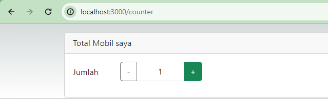

This is a [Next.js](https://nextjs.org/) project bootstrapped with [`create-next-app`](https://github.com/vercel/next.js/tree/canary/packages/create-next-app).

## Getting Started

First, run the development server:

```bash
npm run dev
# or
yarn dev
# or
pnpm dev
# or
bun dev
```

Open [http://localhost:3000](http://localhost:3000) with your browser to see the result.

You can start editing the page by modifying `pages/index.tsx`. The page auto-updates as you edit the file.

[API routes](https://nextjs.org/docs/api-routes/introduction) can be accessed on [http://localhost:3000/api/hello](http://localhost:3000/api/hello). This endpoint can be edited in `pages/api/hello.ts`.

The `pages/api` directory is mapped to `/api/*`. Files in this directory are treated as [API routes](https://nextjs.org/docs/api-routes/introduction) instead of React pages.

This project uses [`next/font`](https://nextjs.org/docs/basic-features/font-optimization) to automatically optimize and load Inter, a custom Google Font.

## Laporan Praktikum Minggu 6

Nama: Wulan Maulidiah <br>
NIM: 2341728038 <br>
Kelas: TI - 3A

1. Menjalankan project next.js
 <br>
2. Mengakses http://localhost:3000/login, dan klik tombol login. Kemudian lakukan refresh page berkali-kali (jika perlu restart npm run dev nya). Simpulkan apa yang terjadi ?
 <br>
Saat kita menjalankan http://localhost:3000/login, dan klik tombol login maka akan berhasil muncul halaman yay, berhasil login!!!. Namun, jika dilakukan refresh secara berulang maka akan tampil kode error "Text content does not match server-rendered HTML", hal ini terjadi karena konten yang dihasilkan oleh React pada sisi klien tidak cocok dengan konten yang dihasilkan saat server-side rendering (SSR).
 <br>
Baris 25 dan 30 terdapat method parse(), apa yang terjadi jika kita tidak menggunakan method tersebut? 
Kemudian pada baris 25 dan 30, ketika kita tidak menggunakan method tersebut maka akan menuliskan kode jsx-nya secara langsung tanpa mengubah string menjadi elemen React. Karena sesuai dengan fungsinya, Method parse() digunakan untuk mengubah string HTML menjadi elemen-elemen React yang dapat dirender di dalam komponen React. Penggunaan parse() biasanya digunakan ketika memiliki string HTML yang ingin dirender di dalam komponen React.

3.  Jalankan di browser dengan url localhost:3000/counter, dan amati apa yang terjadi?
 <br>

## Tugas Pertanyaan Praktikum
1. useEffect adalah React Hook yang pada file ini berfungsi untuk menyinkronkan komponen dengan sistem eksternal. Atau dengan kata lain fungsi import { useEffect } from "react" dalam file _app.tsx adalah memungkinkan peenggunaan hook "useEffect" dalam komponen MyApp yang digunakan untuk memuat skrip JavaScript Bootstrap setelah aplikasi dirender.

2. Dalam hal ini fungsi untuk memuat skrip JavaScript Bootstrap tidak akan dijalankan, karena tidak ada lagi penggunaan useEffect untuk memicu tindakan tersebut. Oleh karena itu, skrip JavaScript Bootstrap tidak akan dimuat secara otomatis saat aplikasi dimulai. Misalnya, komponen bootstrap yang membutuhkan javascript (seperti dropdown, modal, dan lain-lain) tidak berfungsi dengan benar. Kemudian, dari segi tampilan komponen yang mungkin membutuhkan gaya dari Bootstrap CSS dan file global CSS akan terlihat biasa saja tanpa memiliki fungsionalitas tambahan dari Bootstrap Javascript. Selain itu, juga akan terjadi kegagalan render yang menyebabkan aplikasi tidak menampilkan konten apapun pada user.

3. Di React/Next.js, penggunaan className daripada class dalam tag HTML diperlukan karena JSX (JavaScript XML) adalah ekstensi sintaks JavaScript yang digunakan untuk menulis kode React. Jika kita menggunakan class dalam JSX, JavaScript akan menganggapnya sebagai kata kunci class yang digunakan untuk membuat objek, bukan sebagai atribut kelas dalam konteks HTML

4. Next.js tidak memiliki pembatasan pada jumlah reducer yang dapat user gunakan dalam store Redux. User dapat mengatur store Redux-nya dengan banyak reducer sesuai kebutuhan aplikasi.

5. File store.js biasanya digunakan untuk membuat dan mengonfigurasi store Redux dalam aplikasi Redux. Ini adalah tempat di mana user dapat mendefinisikan store Redux, menggabungkan reducer-reducer aplikasi, dan mungkin mengkonfigurasi middleware Redux.

6. Kode *const { isLogin } = useSelector((state) => state.auth);* merupakan contoh penggunaan React Redux Hooks (useSelector dan useDispatch) dalam sebuah functional component di aplikasi React/Next.js. *useSelector* adalah hook yang digunakan untuk mengakses state dari store Redux dalam komponen functional. Sedangkan *state.auth* mengacu pada bagian dari state aplikasi yang berisi informasi tentang autentikasi pengguna untuk  mengambil nilai isLogin dari state Redux yang disimpan dalam store.

7. *state.counter* merujuk ke bagian dari state aplikasi yang dikelola oleh reducer counter. Digunakan untuk mengambil nilai totalCounter dari state Redux yang dikelola oleh reducer counter, dan dispatch digunakan untuk memicu aksi Redux jika diperlukan.